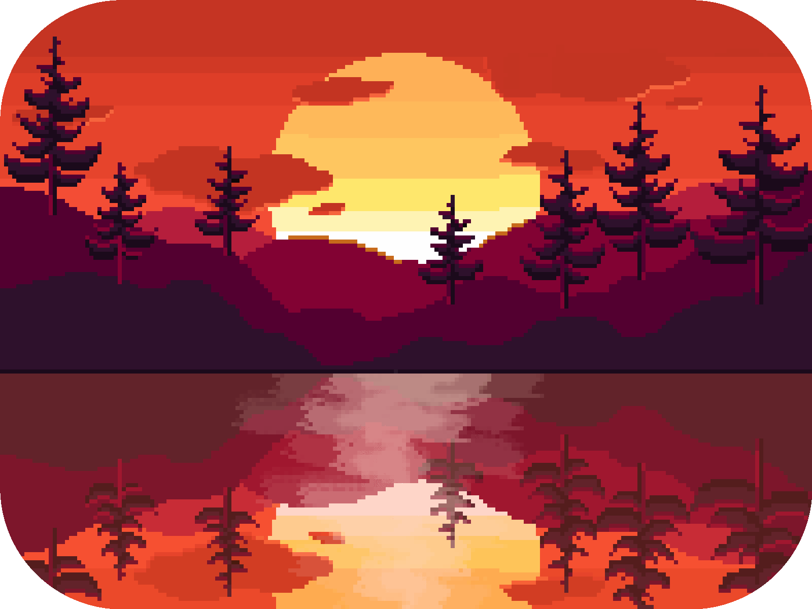

<h1><strong>Hi there 👋</strong></h1> 

<br>

```js
const name = 'Nathan Vitor';
document.write("Hello World");

const status = 
{ 
  learning: [ JavaScript, React ],
}
```

<br>

<div>

<h1><strong>About me 👤</strong></h1> 

<br>




<div align="left">


- 🎈 I'm 21 years old 

- 🌏 From Brazil 
- 🚀 Web Development Student at Trybe <a href='https://www.betrybe.com/'> </a>
- 📫 How to reach me:  **nathanvitor38@gmail.com** 
<a href="https://linkedin.com/in/nathanpw12" target="blank"></a>
<a href="https://instagram.com/nathanpw12" target="blank"></a>
<a href="https://twitter.com/nathanpw12" target="blank"></a>

<br>
<br>
<br>


<h1><strong>Knowledges and Github Statistics</strong></h1>
<br>
<div>
<table align='left'>
    <tbody>
        <tr valign="top">
            <td width="80px" align="center">
            <span><strong>Javascript</strong></span><br>
            
            </td>
            <td width="80px" align="center">
            <span><strong>HTML</strong></span><br>
            
            </td>
            <td width="80px" align="center">
            <span><strong>CSS</strong></span><br>
            
            </td>
            <td width="80px" align="center">
            <span><strong>React</strong></span><br>
            
            </td>
        </tr>
        <tr valign="top">
            <td width="80px" align="center">
            <span><strong>Jest</strong></span><br>
            
            <td width="80px" align="center">
            <span><strong>RTL</strong></span><br>
            
            </td>
            <td width="80px" align="center">
            <span><strong>git</strong></span><br>
            
            </td>
            <td width="80px" align="center">
            <span><strong>GitHub</strong></span><br>
            
            </td>
        </tr>
        <tr valign="top">
            <td width="80px" align="center">
            <span><strong>Sass</strong></span><br>
            
            </td>
            <td width="80px" align="center">
            <span><strong>Linux</strong></span><br>
            
            </td>
            <td width="80px" align="center">
            <span><strong>Node</strong></span><br>
            
            <td width="80px" align="center">
            <span><strong>Jest</strong></span><br>
            
            </td>
        </tr>
        <tr valign="top">
            <td width="80px" align="center">
            <span><strong>Redux</strong></span><br>
            
            </td>
            <td width="80px" align="center">
            <span><strong>Figma</strong></span><br>
            
            </td>
            <td width="80px" align="center">
            <span><strong>ESLint</strong></span><br>
            
            <td width="80px" align="center">
            <span><strong>Bash</strong></span><br>
            
            </td>
        </tr>
    </tbody>
</table>

<div align='right'>


<p>&nbsp;</p>
<p></p>

</div>
</div>

<br>
<br>
<br>

<div>
<h1><strong>Projects</strong></h1>
🚧 <strong> coming soon </strong> 🚧
</div>


<!-- <a href="https://github.com/anuraghazra/github-readme-stats">
  
</a>
<a href="https://github.com/anuraghazra/anuraghazra.github.io">
  
</a> -->
